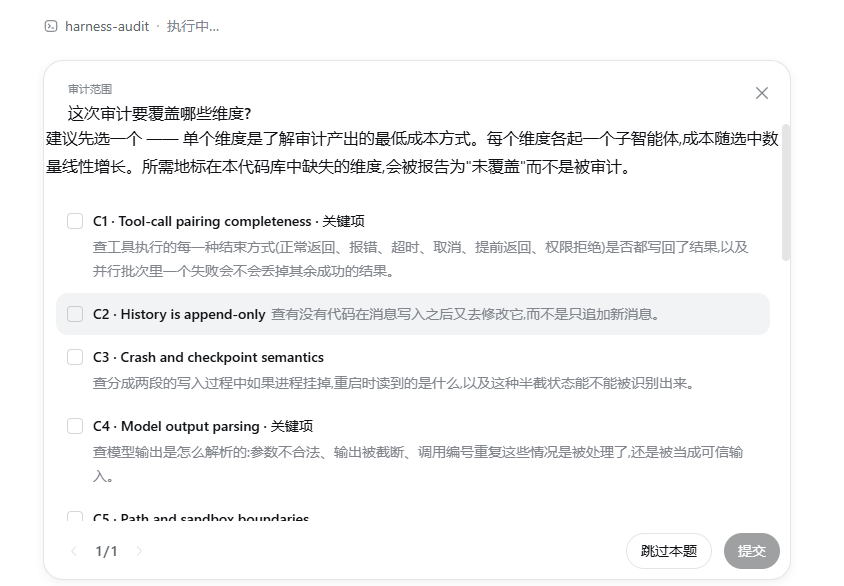
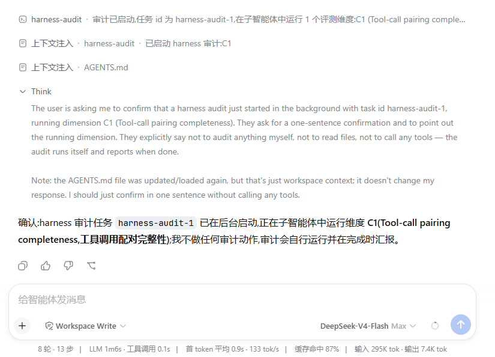
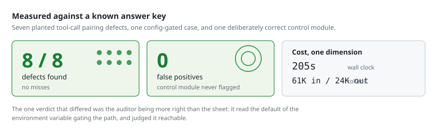
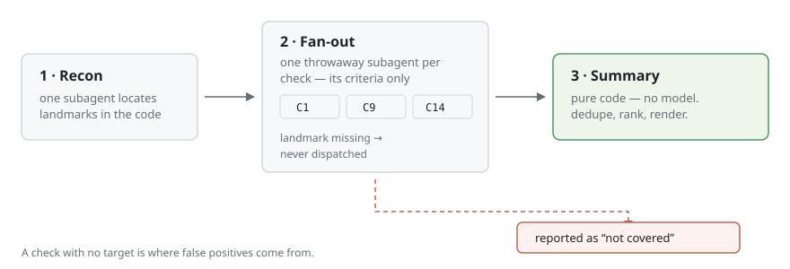
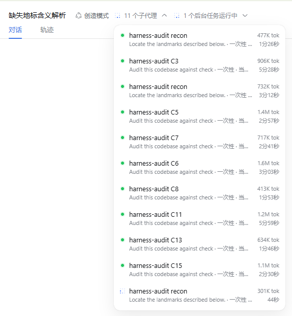
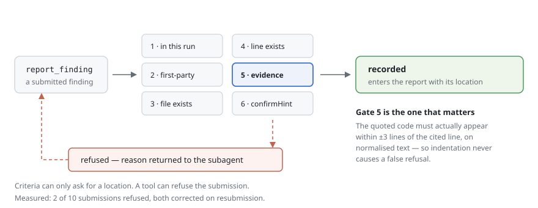

# dsh-harness-audit

English | [中文](README.zh.md)

Audits an agent harness for the failure modes that break agent loops — and
refuses any finding whose evidence isn't actually in the code.

Fifteen checks, one throwaway subagent each, and a summary written by code
rather than by a model. The plugin is self-contained: installing it installs
the criteria too.

## The fifteen checks

Each check is one failure mode of an agent loop, and states what to look at.

<!-- checks:start -->

**State stays self-consistent**

| | Check | What it examines |
|---|---|---|
| `C1` ★ | Tool-call pairing completeness | Whether every way tool execution can end — error, timeout, cancellation included — still records a result, and whether one failure in a parallel batch discards the rest. |
| `C2` | History is append-only | Whether anything edits a message after it was added, rather than only appending new ones. |
| `C3` | Crash and checkpoint semantics | What a reader sees if the process dies between the two halves of a multi-part write, and whether that half-written state is detectable on restart. |

**Untrusted input is treated as untrusted**

| | Check | What it examines |
|---|---|---|
| `C4` ★ | Model output parsing | How model output is parsed: whether malformed arguments, a truncated stream, or a repeated call id are handled rather than trusted. |
| `C5` | Path and sandbox boundaries | Whether a model-supplied path is resolved and checked against the workspace root — after symlink resolution, not before. |
| `C6` | Secrets and ambient environment | What environment a model-generated command inherits, and whether secrets are in it. |

**Failure is a first-class outcome**

| | Check | What it examines |
|---|---|---|
| `C7` | Error taxonomy and retryability | Whether failures carry a closed set of error codes classified as retryable, not retryable, or fatal — or arrive as unclassified text. |
| `C8` | Partial success | Whether independent outcomes collapse into a single status, so one failure hides or discards the successes beside it. |
| `C9` ★ | Idempotency and side-effect safety | What sits inside the retry wrapper: if the retried region performs a write, a command, or an outbound message, a retry repeats it. |

**Boundaries can be closed**

| | Check | What it examines |
|---|---|---|
| `C10` ★ | Cancellation propagation | Whether the cancellation signal actually reaches outbound requests and spawned subprocesses, or stops at the loop. |
| `C11` | Timeout layering | The timeout layers on one tool call and their relative sizes — the tool budget must expire before the resource underneath it. |
| `C12` ★ | Loop and budget limits | Whether hard ceilings exist on turns, tool calls, wall-clock time, tokens, and delegation depth. |

**Finite resources are accounted for**

| | Check | What it examines |
|---|---|---|
| `C13` ★ | Context management and truncation boundaries | Whether context is managed at all as a session grows, and where truncation cuts — a cut through a call/result pair breaks the history. |
| `C14` ★ | Prompt prefix determinism | Whether everything before the newest message — system prompt, tool definitions, prior messages — is byte-identical between runs, which is what the cache needs. |

**The run is observable**

| | Check | What it examines |
|---|---|---|
| `C15` | Trace completeness and replay | Whether the run leaves an event record covering turns, tool calls and results, retries, truncation, and approvals, complete enough to reconstruct it. |

★ marks the seven critical checks — `/harness-audit p1` runs exactly these.

<!-- checks:end -->

## Use

```
/harness-audit          # asks which dimensions, with a plain-language menu
/harness-audit C1       # one dimension
/harness-audit C1,C9    # several
/harness-audit p1       # the seven critical ones
/harness-audit all      # all fifteen
```



The command returns immediately and the audit runs as a background job, so it
does not block the session. When it finishes, the agent is woken and reports.
Ask for progress at any time with `job_output <id>`.



Two files land in `outputDir` (default `.harness-audit/`), named by local time
and the dimensions covered:

```
report-2026-08-17_095736-C1.md
report-2026-08-17_095736-C1.json
```

Input that cannot be parsed is **refused**, never silently reinterpreted — an
earlier version accepted only `--checks`, so `--check c2` fell through to a
configured default and audited a different dimension without saying so.

## Does it work?



Measured against a fixture with known defects — seven deliberate C1 bugs, one
config-gated case, and one deliberately correct module as a false-positive
probe:

| | |
|---|---|
| Defects found | **8 of 8** |
| False positives | **0** — the correct module was never flagged |
| Evidence rejections | 2 of 10 submissions, both corrected on resubmission |
| Cost | 205s, 61K in / 24K out for one dimension |

The one verdict that differed from the fixture's answer key was the auditor
being *more* right than the sheet: it read the default of the environment
variable gating the path and judged it reachable.

```bash
npm test --prefix dsh-harness-audit
```

191 tests. The load-bearing ones assert that every check carries criteria a
subagent can judge by, that a check prompt carries **only its own** criteria,
and that no prompt has drifted back to asking for a document that is not
installed.

## How a run works



1. **Recon** — one subagent locates landmarks (agent loop, request assembly,
   tool execution, …) and reports them through `report_landmark`.
2. **Fan-out** — one throwaway subagent per check, each given exactly one
   check's criteria and only the landmarks that check depends on. A check whose
   required landmark was not found is **not dispatched**; it is recorded as not
   covered. Running a check with no target is a leading source of false
   positives.
3. **Summary** — pure code. No model writes it: that is how `suspected` turns
   into `confirmed` and how unevidenced claims get in.



One entry per check, each with its own cost. That separation is what makes the
per-check figures in the report real rather than estimated.

## Evidence validation



`report_finding` refuses a submission unless:

1. the check belongs to this run,
2. the path is first-party code — not `.venv`, `site-packages`, `node_modules`, …,
3. the file exists inside the workspace (also the path-traversal gate),
4. the line exists in that file,
5. **the quoted evidence actually appears within ±3 lines of the cited line**, and
6. a `suspected` verdict carries a `confirmHint`.

Rule 5 compares normalised text — trimmed, internal whitespace collapsed — not
bytes, so indentation differences don't cause spurious refusals. A refusal is
returned to the subagent with the reason, and in practice it re-reads the file
and resubmits correctly.

**The rejection rate is the metric to watch.** Every report states it. A high
rate means the subagents are fabricating and the prompts need work. It is never
a reason to relax validation.

Scope enforcement exists for the same reason. A first run against a Python
project located all 23 landmarks inside `.venv/site-packages/`, auditing the
vendored framework rather than the project. Asking was not enough; the tools
now refuse those paths, and the same run costs 147s instead of 698s.

## Install

### First, get DeepSeek Harness

This is a plugin — it needs a `dsh` install to mount into. With Node.js
present:

```sh
npx @deepseek-ai/dsh web
```

That starts the Web UI at `http://127.0.0.1:3080`. Or from a source checkout:

```sh
git clone https://github.com/deepseek-ai/deepseek-harness.git
cd deepseek-harness
pnpm install
pnpm run build
pnpm dsh web
```

Two things worth knowing before you build on it:

- **DeepSeek Harness is a developer preview and there will be
  compatibility-breaking changes.** This plugin pins its peer dependencies to
  `^0.1.0-rc.5` for that reason.
- **`dsh plugin` shells out to pnpm**, so pnpm must be on your PATH for the
  install step below.

### Then install this plugin

```bash
dsh plugin --profile web add dsh-harness-audit
```

`npm i dsh-harness-audit` downloads the package but does **not** activate it —
`dsh plugin add` installs it into the profile, and the `dsh.bundle` declaration
in `package.json` is what gets its configuration layer mounted. Check it landed:

```bash
dsh --profile web --dump-config
```

A `# == dsh-harness-audit` layer should appear. To remove it later, use the
package name:

```bash
dsh plugin --profile web remove dsh-harness-audit
```

Distribution is via npm or `pnpm pack`. A GitHub install works too, but pulls
source rather than build output: pnpm must run this package's `prepare` script,
which the user has to authorise in their profile's `pnpm-workspace.yaml`. That
authorisation lets this package's code run on their machine outside any agent
sandbox, so pin the commit:

```bash
dsh plugin --profile web add github:you/repo#<commit-sha>
```

Without the sha the install resolves to whatever the default branch points at
*at install time*, so two people running the same command on different days get
different code. The prebuilt paths avoid the question entirely.

### Development

```bash
pnpm dsh --profile web --patch ./dsh-harness-audit/cordis.yml
```

Four things that cost time when they are wrong:

- **`web` is an alias for `--profile web`** and rejects `--patch` alongside it.
  Use `--profile web`.
- **The `name` in `cordis.yml` must be an installed package name or an absolute
  `file://` URL.** Node's ESM loader accepts only `file:`, `data:` and `node:`
  schemes — a bare `F:/…` fails with `Received protocol 'f:'`, and a git URL
  cannot work here at all. Git URLs belong in `dsh plugin add`, not in a patch
  row.
- **Running `dsh` from a source checkout requires that checkout to be built**
  (`npm run build:lib:host` at minimum), or the boot fails in `typert-loader`
  before any plugin loads. A built install — what real users have — is fine.
- **`pnpm install` here needs `--ignore-workspace`** when the package sits
  inside another pnpm workspace's tree; without it pnpm installs the outer
  workspace and ignores this package entirely.

## Configuration

| Field | Default | Meaning |
|---|---|---|
| `checks` | `[]` | Check ids to run. Empty means "ask", never "audit everything". |
| `priorityFloor` | `2` | Run checks at or below this priority (1 = P1 only). An explicitly named check runs regardless. |
| `concurrency` | `3` | Checks in flight at once. `1` is supported and is the cheapest way to debug. |
| `subagentProvider` | `spawn` | Subagent provider name. |
| `maxTokensPerCheck` | `120000` | **Advisory.** See the limitations below. |
| `outputDir` | `.harness-audit` | Workspace-relative report directory. |
| `announceOnStart` | `true` | Post a one-line notice when a run starts, so a fresh session has something to attach the job UI to. |
| `background` | `true` | Run as a job. `false` blocks the command until the audit finishes. |
| `useLsp` | `true` | Try LSP navigation, degrading to text search. |
| `crossCheckAnalysis` | `false` | Reserved; not yet emitted. |
| `language` | `auto` | Output language. `auto` follows the harness locale, then the host locale, then English. |
| `excludePaths` | dependency dirs | Directory names refused as out of scope. `[]` audits a vendored framework deliberately. |

## Known limitations

- **`maxTokensPerCheck` is advisory.** The subagent seam has no whole-run token
  cap — `AgentOptions.maxTokens` bounds a single response, not a run — so the
  budget is stated to the subagent and recorded, and the report gives the
  observed cost. It is not enforced.
- **`crossCheckAnalysis` is not implemented.** When built, its output must be a
  separate section marked as model inference that did not pass validation.
- **LSP availability is per-extension.** The seam exposes no capability query,
  so availability is observed by running a query and routing on the thrown
  `LspError`. The probe runs after recon, using the detected primary language,
  and speaks only for that language.
- **Token attribution needs a local subagent provider.** Cost is folded from the
  child's session events; a remote provider publishes no local child session, so
  its usage reads as zero.
- **A run in a brand-new session shows nothing until the first turn.** Command
  dispatch produces no turn, and the conversation's UI slots are session-scoped,
  so the job indicator has nowhere to attach until something else starts one.
  `announceOnStart` exists to start one.

## Design notes

**The criteria live in `src/criteria.ts`, not in a skill.** An earlier version
shipped a bundled `harness-evaluation` skill that subagents loaded at run time.
That indirection is gone so that installing the plugin installs everything.
The trade is recorded in that file's header: changing a criterion is now a code
change and a release, and a project can no longer override the criteria by
shipping its own skill of the same name.

**Each check's criteria are handed to its subagent verbatim, and only its own.**
The plugin's `name`, `group` and picker glosses are navigation copy; no subagent
is shown them, and they must never stand in for the criteria.

**Audit children are not tool-scoped.** An earlier version passed
`toolFilter: { allow: [...] }`, built from names resolved in the plugin's own
scope. Model-facing tools live on the agent plane, so the list collapsed to one
entry and `tools.restrict()` removed everything else — recon came back with
`unknown tool "read"`. There is no supported way to enumerate a child's scope
before it exists, and guessing is worse than not scoping.
